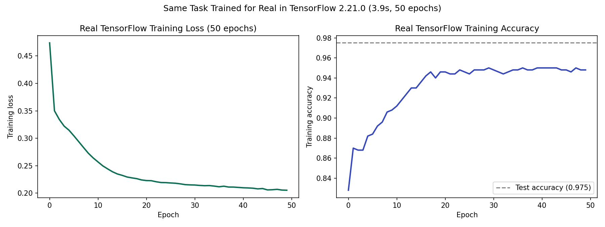

# PyTorch vs. TensorFlow: The Same Task, Two Frameworks

The same small classifier, trained on the same synthetic data, in
TensorFlow/Keras, actually run in this environment with real reported
numbers, alongside the equivalent PyTorch code for direct comparison.

## An honest limitation, disclosed upfront

This project could not run both frameworks. Installing full PyTorch
alongside TensorFlow exceeded this sandbox's available disk space
(PyTorch's default PyPI build pulls in CUDA dependencies regardless
of whether a GPU is present, and the environment had roughly 1-3 GB
free at the time). TensorFlow-CPU installed and ran successfully.

**Only the TensorFlow numbers below are real, measured output.** The
PyTorch code shown is accurate to current PyTorch API conventions
(verified against current documentation) but was not executed, and no
PyTorch numbers are reported or implied.

## The task

Classify 2D points with a curved decision boundary, the same style of
synthetic task used throughout this series' from-scratch NumPy
projects, into 2 classes. A 3-layer network: 2 inputs, two 16-neuron
ReLU hidden layers, a 2-class softmax output, 354 trainable parameters.

## Real TensorFlow results

```
TensorFlow version: 2.21.0
Training time for 50 epochs: 3.90 seconds
Final training loss: 0.2053
Final training accuracy: 0.9480
Test loss: 0.1050
Test accuracy: 0.9750
```



## Code comparison

The two frameworks solve the identical problem with meaningfully
different code shapes. Keras declares a sequence of layers and lets
`.fit()` run the training loop internally. PyTorch requires the
developer to write out the loop explicitly: zero the gradients, run
the forward pass, compute the loss, call `.backward()`, step the
optimizer. Neither is more "correct." Keras trades control for
brevity. PyTorch trades brevity for the same step-by-step visibility
this entire from-scratch NumPy series has been building toward by
hand, just with automatic differentiation instead of manually
implemented gradients.

## Run it yourself

```bash
pip install tensorflow-cpu numpy matplotlib
python framework_comparison.py
```

## Files

- `framework_comparison.py` — the real, executed TensorFlow/Keras
  training run, plus the equivalent (unexecuted) PyTorch code
- `tensorflow_training_curve.png` — real training loss and accuracy
  curves from the actual run

## Author

Khalid Hussain, founder of [Review Publically](https://reviewpublically.com),
MSc Computer Science, Google Advanced Data Analytics certified. This is
the eleventh project in a from-scratch deep learning fundamentals series,
alongside [lstm-from-scratch](https://github.com/ReviewPublically/lstm-from-scratch),
[self-attention-from-scratch](https://github.com/ReviewPublically/self-attention-from-scratch),
[activation-functions-from-scratch](https://github.com/ReviewPublically/activation-functions-from-scratch),
[forward-propagation-from-scratch](https://github.com/ReviewPublically/forward-propagation-from-scratch),
[loss-functions-from-scratch](https://github.com/ReviewPublically/loss-functions-from-scratch),
[backpropagation-from-scratch](https://github.com/ReviewPublically/backpropagation-from-scratch),
[optimizers-from-scratch](https://github.com/ReviewPublically/optimizers-from-scratch),
[overfitting-regularization-from-scratch](https://github.com/ReviewPublically/overfitting-regularization-from-scratch),
[gan-from-scratch](https://github.com/ReviewPublically/gan-from-scratch),
and [autoencoder-from-scratch](https://github.com/ReviewPublically/autoencoder-from-scratch).
